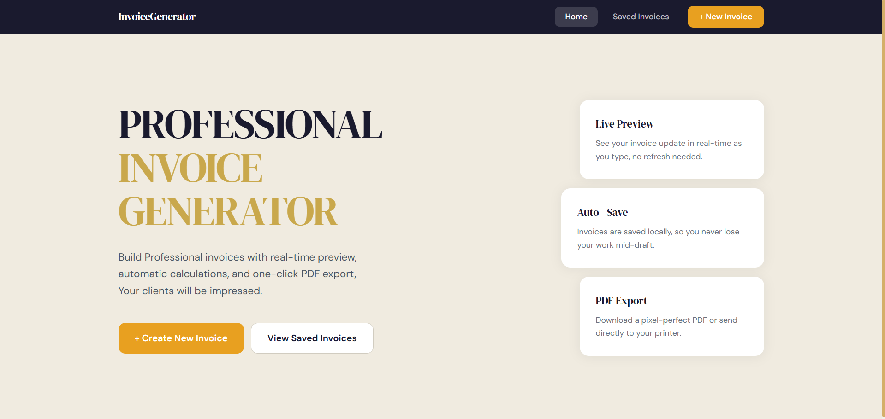
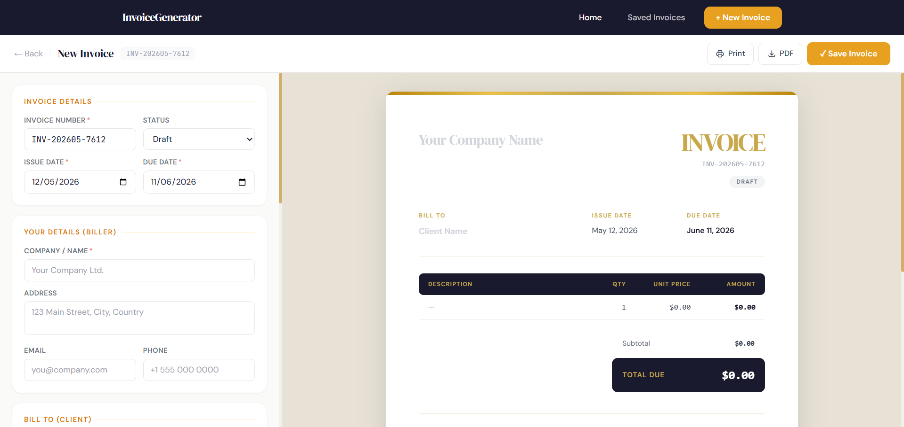

# InvoiceGenerator
> Built by **Hesandi Wickramasinghe** 

A complete, professional Invoice Generation Web App using MERN stack. Generate, view, export and manage clean, responsive invoices based on a custom Figma mockup.

---

## Screenshots

### Homepage


### Invoice Editor — Split Live Preview


---

## Tech Stack

| Layer | Technology |
|-------|-----------|
| Frontend | React 18 (functional components + hooks only) |
| Backend | Node.js + Express.js |
| Database | MongoDB + Mongoose |
| Styling | Tailwind CSS v3 |
| PDF Export | jsPDF + html2canvas |
| Routing | React Router v6 |
| HTTP Client | Axios |
| Build Tool | Vite |
| Dev Runner | Nodemon + Concurrently |

---

## Features

- **Invoice Form** - Biller information, client data, auto-generated invoice number, issue and due dates, dynamic line items table, percentage based tax/discount table, notes & payment terms
- **Live Preview** - Real-time right-panel preview that updates on every keystroke, no refresh needed
- **PDF Export** - One-click PDF download (jsPDF + html2canvas) with multi-page support
- **Print Support** - Clean browser print stylesheet so the exported output matches the on-screen preview exactly
- **Input Validation** - Required fields, numeric checks, due date must be after issue date, empty line item checks
- **Data Persistence** - localStorage auto-save (works fully offline) + MongoDB backend when available
- **Saved Invoices** - List all saved invoices, edit or delete any entry 
- **Status Tracking** - Draft, Sent, Paid, Overdue with colour-coded badges
- **Responsive Design** - Desktop split-panel layout; mobile tab-switcher between Edit Form and Preview

---

## Project Structure

```
invoice-app/
├── client/                          # React frontend (Vite)
│   ├── index.html
│   ├── vite.config.js
│   ├── tailwind.config.js
│   └── src/
│       ├── App.jsx                  # Route definitions
│       ├── main.jsx                 # React DOM entry point
│       ├── index.css                # Tailwind directives + print CSS + animations
│       ├── components/
│       │   ├── Layout.jsx           # Sticky navbar + page shell
│       │   ├── InvoiceForm.jsx      # Left-panel form with all fields
│       │   ├── InvoicePreview.jsx   # Right-panel live print-ready preview
│       │   ├── LineItemsTable.jsx   # Dynamic add/remove line items
│       │   └── ExportToolbar.jsx    # PDF download + Print buttons
│       ├── hooks/
│       │   └── useInvoice.js        # All invoice state + update logic
│       ├── pages/
│       │   ├── HomePage.jsx
│       │   ├── InvoiceEditorPage.jsx
│       │   └── SavedInvoicesPage.jsx
│       └── utils/
│           ├── api.js               # Axios client configured for the Express API
│           └── invoiceUtils.js      # calculateTotals, formatCurrency, localStorage helpers
│
└── server/                          # Express backend
    ├── index.js                     # Server entry — connects MongoDB, registers routes
    ├── .env                         # Environment variables (not committed)
    ├── .env.example                 # Safe template to copy
    ├── models/
    │   └── Invoice.js               # Mongoose schema with pre-save total computation
    ├── controllers/
    │   └── invoiceController.js     # getAllInvoices, getById, create, update, delete
    └── routes/
        └── invoiceRoutes.js         # REST route definitions
```

---

## API Endpoints

| Method | Endpoint | Description |
|--------|----------|-------------|
| GET | `/api/health` | Server health check |
| GET | `/api/invoices/generate-number` | Generate a fresh invoice number |
| GET | `/api/invoices` | List all invoices (newest first) |
| GET | `/api/invoices/:id` | Get a single invoice |
| POST | `/api/invoices` | Create a new invoice |
| PUT | `/api/invoices/:id` | Update an existing invoice |
| DELETE | `/api/invoices/:id` | Delete an invoice |

---

## How to Run Locally

### Prerequisites

- **Node.js** v18+ — [nodejs.org](https://nodejs.org)
- **MongoDB** (local or Atlas) — see setup below
- **Git** — [git-scm.com](https://git-scm.com)

---

### Quick Start (Single Command)
```bash
cd client && npm install && cd ../server && npm install && cd .. && npm run dev
```

---

### Step 1 — Clone

```bash
git clone https://github.com/HesandiWickramasinghe21/Invoice-Generation-System
cd invoice-app
```

### Step 2 — Install dependencies

```bash
# From the root folder:
npm install

cd client && npm install && cd ..
cd server && npm install && cd ..
```

### Step 3 — Configure environment

```bash
cp server/.env.example server/.env
```

Open `server/.env` and set your MongoDB connection:

```
PORT=5000
MONGODB_URI=mongodb://localhost:27017/invoice_db
NODE_ENV=development
```

> **MongoDB Atlas?** Use your Atlas URI instead:
> `MONGODB_URI=mongodb+srv://<user>:<password>@cluster0.xxxxx.mongodb.net/invoice_db`

> **No MongoDB installed?** No problem — the app works fully offline using localStorage. Skip this step.

### Step 4 — Start both servers

```bash
npm run dev
```

- Frontend → **http://localhost:5173**
- Backend API → **http://localhost:5000**

### Step 5 — Open the app

Visit **http://localhost:5173** in your browser and start creating invoices.

---

## MongoDB Setup

### Local MongoDB

```bash
# macOS (Homebrew)
brew services start mongodb-community

# Windows
mongod

# Linux
sudo systemctl start mongod
```

### MongoDB Atlas (Free Cloud)

1. Sign up at [cloud.mongodb.com](https://cloud.mongodb.com)
2. Create a free **M0** cluster
3. Go to **Connect → Drivers** → copy the connection string
4. Paste it into `server/.env` as `MONGODB_URI`
5. Whitelist your IP under **Network Access**

---

## Known Limitations

- No user authentication (single-user system)
- Currency is fixed to USD
- PDF rendering quality depends on browser font loading — let the page fully load before exporting

## Future Improvements

- Email invoice to client via SendGrid / Nodemailer
- Multi-currency with live exchange rates
- Multiple invoice templates (minimal, corporate, creative)
- User accounts with per-user invoice history
- Revenue analytics dashboard
- Recurring invoice scheduling
- Client address book
